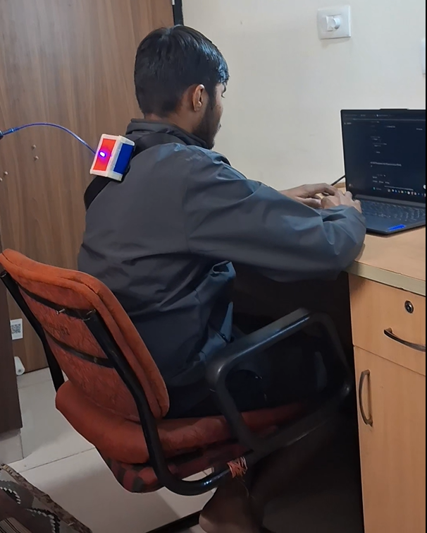

# POSTURA – Wearable Posture Monitoring Device

POSTURA is a compact, low-cost wearable designed to encourage healthy posture habits through real-time feedback.  
It focuses on preventive health and addresses posture-related issues caused by prolonged sitting and screen usage.

---

**Theme:** Health-Tech & Social Impact  

POSTURA acts as a preventive health-tech solution by promoting posture awareness before long-term back and spinal problems develop.

---

## Problem Statement
Poor posture due to prolonged sitting leads to back pain, fatigue, and long-term musculoskeletal issues, especially among students and desk workers.

---

## Our Solution
POSTURA is worn on the upper back and continuously monitors posture using motion sensors.  
It automatically calibrates to the user’s correct sitting posture and provides vibration feedback when unhealthy slouching is detected.

---

## Key Features
- Compact upper-back wearable  
- Real-time posture monitoring  
- Automatic posture calibration  
- Slouch detection using tilt angle  
- Instant vibration alert  
- Adjustable sensitivity  
- App-based daily posture summary 
- Low-power, privacy-focused design  

---

## How It Works
1. User wears the device on the upper back  
2. Device auto-calibrates to upright posture  
3. Posture is monitored continuously  
4. Slouch beyond healthy threshold triggers vibration  
5. Daily posture summary available via app (v2)

---

## Prototype Demo
🎥 Working prototype demonstration video:  
https://youtube.com/shorts/IOyoy3nKbvY?feature=share

---

## Project Status
- ✅ Working hardware prototype  -DONE
- 🔄 App integration (v2)        -READY
- 🔄 Size optimization           -DONE

---
## 📸 Prototype Images

### Working Prototype
## 📸 Prototype in Use

## Disclaimer
POSTURA is a non-medical, assistive device intended for posture awareness and habit improvement.
